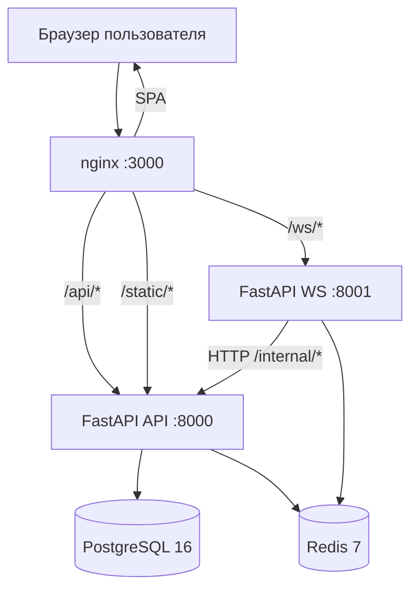
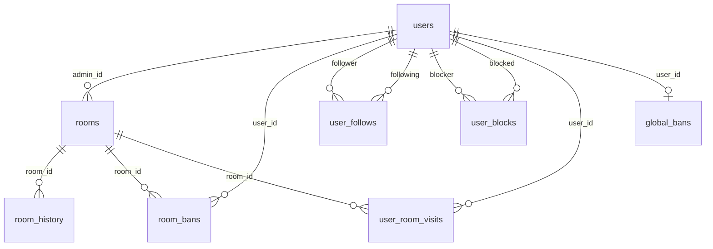

# AbsoluteCinema — материал для защиты курсового проекта

> **Назначение документа:** подробное описание курсовой работы для подготовки к защите, составления конспектов и генерации тестов через нейросети.  
> **Проект:** веб-платформа синхронного совместного просмотра видео.  
> **Рабочее имя backend:** FastWatch (в коде API). **Бренд в UI:** AbsoluteCinema.

---

## Содержание

1. [Краткое описание проекта](#1-краткое-описание-проекта)
2. [Цель, задачи и актуальность](#2-цель-задачи-и-актуальность)
3. [Функциональные возможности](#3-функциональные-возможности)
4. [Архитектура системы](#4-архитектура-системы)
5. [Технологический стек и обоснование выбора](#5-технологический-стек-и-обоснование-выбора)
6. [Структура репозитория](#6-структура-репозитория)
7. [База данных PostgreSQL](#7-база-данных-postgresql)
8. [Backend: REST API](#8-backend-rest-api)
9. [Backend: бизнес-логика (services)](#9-backend-бизнес-логика-services)
10. [WebSocket и real-time](#10-websocket-и-real-time)
11. [Redis: runtime-состояние](#11-redis-runtime-состояние)
12. [Аутентификация, авторизация, роли](#12-аутентификация-авторизация-роли)
13. [Система профилей](#13-система-профилей)
14. [Комнаты: создание, вход, модерация](#14-комнаты-создание-вход-модерация)
15. [Глобальный администратор](#15-глобальный-администратор)
16. [Frontend](#16-frontend)
17. [Синхронизация видеоплеера](#17-синхронизация-видеоплеера)
18. [Безопасность](#18-безопасность)
19. [Конфигурация и переменные окружения](#19-конфигурация-и-переменные-окружения)
20. [Развёртывание (Docker)](#20-развёртывание-docker)
21. [Миграции Alembic](#21-миграции-alembic)
22. [Тестирование](#22-тестирование)
23. [Сценарий демонстрации на защите](#23-сценарий-демонстрации-на-защите)
24. [Типичные вопросы комиссии и ответы](#24-типичные-вопросы-комиссии-и-ответы)
25. [Ограничения и возможное развитие](#25-ограничения-и-возможное-развитие)
26. [Глоссарий](#26-глоссарий)

---

## 1. Краткое описание проекта

**AbsoluteCinema** — full-stack веб-приложение для **совместного синхронного просмотра видео** в виртуальных «комнатах». Пользователи создают комнату, добавляют ссылку на видео (YouTube, Vimeo, Rutube и др.), смотрят одновременно с друзьями, общаются в чате и управляют очередью воспроизведения.

Ключевая особенность — **разделение на два backend-процесса**:
- **REST API** — долговременные данные (PostgreSQL), регистрация, профили, создание комнат;
- **WebSocket-сервис** — real-time: плеер, чат, участники, очередь (состояние в Redis).

Frontend — SPA на React, проксируется через nginx в Docker.

---

## 2. Цель, задачи и актуальность

### Цель
Разработать веб-платформу для синхронного группового просмотра видео с поддержкой комнат, чата, очереди, профилей пользователей и администрирования.

### Задачи (что реализовано)
1. Регистрация и аутентификация пользователей (+ гостевой режим).
2. Создание и управление видеокомнатами (открытые/скрытые из каталога).
3. Real-time синхронизация плеера через WebSocket.
4. Чат и системные уведомления в комнате.
5. Очередь видео (основной плейлист + предложения от зрителей).
6. Модерация участников (кик, бан, мут).
7. Профили пользователей с подписками, блокировками и настройками приватности.
8. Глобальная админ-панель (бан пользователей, управление комнатами).
9. Контейнеризация и развёртывание через Docker Compose.

### Актуальность
- Рост популярности «watch party» (совместный просмотр на расстоянии).
- Необходимость синхронизации не только чата, но и **времени воспроизведения** видео.
- Требования к масштабируемости real-time через Redis pub/sub, а не через polling.

---

## 3. Функциональные возможности

### Для всех (включая гостей)
| Функция | Описание |
|---------|----------|
| Гостевой вход | Без регистрации; имя `Guest_XXXX`, данные в `localStorage` |
| Вход в открытую комнату | По ссылке или ID из лобби |
| Синхронный просмотр | Плеер следует состоянию админа комнаты |
| Чат | Текстовые сообщения + системные события |
| Предложение видео | Добавление в «предложку» (suggestion queue) |
| Каталог комнат | `/rooms` — поиск по названию и тегам (`#тег`) |

### Для зарегистрированных пользователей
| Функция | Описание |
|---------|----------|
| Регистрация / вход | JWT в httpOnly cookie |
| Создание комнат | До **3 комнат** на пользователя |
| Свои комнаты | Список на главной (`/rooms/mine`) |
| Профиль | Просмотр, редактирование, подписки, блокировки |
| Вход в скрытые комнаты | Только авторизованные (по ссылке) |
| История просмотров | На странице профиля |

### Для админа комнаты (владелец комнаты)
| Функция | Описание |
|---------|----------|
| Управление плеером | Play / Pause / Seek / смена видео |
| Очередь | Основной плейлист, approve предложений |
| Модерация | Kick, Ban (зарег.), Mute / Unmute |
| «Собрать всех» | Синхронизация времени у всех участников |
| Настройки комнаты | Название, теги, скрытость из каталога |
| **Закрыть комнату** | Вкладка «⚙️ Админ» → удаление комнаты |
| История видео | `/rooms/{id}/history` |

### Для глобального администратора
| Функция | Описание |
|---------|----------|
| Страница `/admin` | Доступ по флагу `is_global_admin` |
| Глобальный бан | Блокировка пользователя на всём сайте |
| Управление любыми комнатами | Редактирование, закрытие |

### Автоматические процессы
| Функция | Описание |
|---------|----------|
| Очистка неактивных комнат | Если **1 час** без входов и **0 онлайн** — комната удаляется |
| Назначение global admin | По `GLOBAL_ADMIN_USERNAMES` при старте / входе / регистрации |

---

## 4. Архитектура системы

### 4.1. Диаграмма сервисов



### 4.2. Почему два процесса (API + WS)?

| Критерий | REST API | WebSocket |
|----------|----------|-----------|
| Протокол | HTTP request/response | Постоянное двустороннее соединение |
| Данные | PostgreSQL (пользователи, комнаты, баны) | Redis (плеер, чат, онлайн) |
| Масштабирование | Stateless (кроме сессии БД) | Stateful connections; pub/sub для fan-out |
| Нагрузка | Редкие запросы (join, profile) | Постоянный поток (каждые play/pause/chat) |

Разделение позволяет **масштабировать WS отдельно** от API и не блокировать HTTP-пул долгими WS-соединениями.

### 4.3. Типичный сценарий «войти в комнату и смотреть»

```
1. Пользователь открывает /room/abc12345
2. Frontend: POST /api/v1/rooms/abc12345/join
   → API проверяет баны, private, block
   → Создаёт ws:session:{token} в Redis (TTL 24ч)
   → Ставит httpOnly cookie fastwatch_ws_token (path /ws/)
   → Возвращает player_state, participant_id, is_admin
3. Frontend: WebSocket ws://host/ws/rooms/abc12345
   → Cookie с token автоматически отправляется
4. WS: accept → send CONNECTED (state, queues, participants, chat history)
5. WS: SYSTEM_MESSAGE «X присоединился»
6. Admin жмёт Play → PLAYER_STATE → Redis pub/sub → все клиенты синхронизируются
```

### 4.4. Internal API (связь WS → API)

WebSocket-сервис **не пишет напрямую в PostgreSQL** для некоторых операций. Вместо этого вызывает **внутренний HTTP API**:

| Endpoint | Когда вызывается |
|----------|------------------|
| `POST /internal/rooms/{id}/history` | Админ поставил новое видео (`SET_VIDEO`) |
| `POST /internal/rooms/{id}/ban` | WS-модерация BAN (сохранить в PG) |

Защита: заголовок `X-Internal-Key` + IP только из внутренней сети Docker (private/loopback).

---

## 5. Технологический стек и обоснование выбора

### Backend

| Технология | Версия | Зачем |
|------------|--------|-------|
| **Python 3.12** | slim Docker | Async/await, экосистема ML/веб, читаемость |
| **FastAPI** | ≥0.115 | Async REST, автодокументация OpenAPI, Pydantic v2 |
| **Uvicorn** | ≥0.32 | ASGI-сервер для FastAPI |
| **SQLAlchemy 2** | async | ORM с `asyncpg`, типизация, миграции |
| **Alembic** | ≥1.14 | Версионирование схемы БД |
| **asyncpg** | ≥0.30 | Быстрый async-драйвер PostgreSQL |
| **Redis 7** | alpine | In-memory: сессии WS, pub/sub, runtime комнаты |
| **passlib + bcrypt** | — | Хеширование паролей |
| **python-jose** | HS256 | JWT access tokens |
| **httpx** | async | WS → internal API calls |
| **Pydantic Settings** | — | Конфиг из `.env` |

**Почему не Django?** — для real-time и лёгкого API FastAPI даёт меньше overhead и нативный async.

**Почему PostgreSQL, а не MongoDB?** — реляционные связи (follows, blocks, bans, FK), ACID для пользователей и модерации.

**Почему Redis?** — sub-millisecond доступ к состоянию плеера/чата; pub/sub для broadcast между WS-инстансами; TTL для WS-сессий.

### Frontend

| Технология | Версия | Зачем |
|------------|--------|-------|
| **React 19** | ^19 | Компонентный UI, hooks, экосистема |
| **TypeScript** | ~5.7 | Типобезопасность, меньше ошибок в API-контрактах |
| **Vite 6** | — | Быстрая сборка dev/prod |
| **React Router 7** | — | SPA-маршрутизация |
| **Tailwind CSS 3** | — | Utility-first стили, тёмная тема проекта |
| **react-player** | ^2.16 | YouTube, Vimeo, Twitch и др. из коробки |

### Infrastructure

| Технология | Зачем |
|------------|-------|
| **Docker Compose** | Один `docker compose up` — весь стек |
| **nginx 1.27** | Reverse proxy: `/api`, `/ws`, SPA fallback |
| **PostgreSQL 16** | Основное хранилище |
| **Redis 7 + AOF** | Persistence Redis при перезапуске |

---

## 6. Структура репозитория

```
AbsoluteCinema/
├── docker-compose.yml       # Оркестрация 5 сервисов
├── .env / .env.example      # Секреты и настройки
├── README.md
├── docs/
│   └── ZASHCHITA_KURSOVOY.md   # Этот файл
├── backend/
│   ├── Dockerfile
│   ├── requirements.txt
│   ├── alembic/               # Миграции БД
│   ├── alembic.ini
│   ├── tests/
│   └── app/
│       ├── main_api.py        # Точка входа REST
│       ├── main_ws.py         # Точка входа WebSocket
│       ├── api/
│       │   ├── deps.py        # Depends: Auth, ActiveUser, GlobalAdmin
│       │   ├── internal.py    # Internal API для WS
│       │   ├── router.py      # /api/v1
│       │   └── v1/            # auth, rooms, profile, admin, lobby
│       ├── core/              # config, database, security, cookies, redis
│       ├── models/            # SQLAlchemy ORM (8 моделей)
│       ├── schemas/           # Pydantic request/response
│       ├── services/          # Бизнес-логика
│       ├── utils/             # generate_room_id, guest names
│       └── ws/                # router, handlers, pubsub, connection_manager
└── frontend/
    ├── Dockerfile             # build → nginx
    ├── nginx.conf
    ├── package.json
    └── src/
        ├── App.tsx            # Маршруты
        ├── api/client.ts      # fetch wrapper
        ├── context/           # AuthContext, ToastContext
        ├── hooks/             # useRoomSocket, useDebouncedValue
        ├── pages/             # 11 страниц
        ├── components/        # Layout, room/*, BannedOverlay
        ├── lib/               # joinRoom, roomSession, links
        └── types/room.ts      # PlayerState, Participant, ChatMessage
```

---

## 7. База данных PostgreSQL

### 7.1. ER-диаграмма (логическая)



### 7.2. Таблицы (подробно)

#### `users`
| Поле | Тип | Описание |
|------|-----|----------|
| id | UUID PK | Идентификатор |
| username | VARCHAR(50) UNIQUE | Логин, pattern `^[a-zA-Z0-9_]+$` |
| email | VARCHAR(255) UNIQUE NULL | Почта |
| password_hash | VARCHAR(255) | bcrypt |
| avatar_url | VARCHAR(512) | Поле в БД (в UI не используется) |
| bio | VARCHAR(500) NULL | О себе |
| tags | VARCHAR(50)[] | Теги интересов |
| link_telegram, link_vk, link_twitch | VARCHAR(255) NULL | Ссылки |
| profile_visibility | VARCHAR(20) | `public` / `subscribers` / `hidden` |
| is_global_admin | BOOLEAN | Глобальный админ |
| created_at | TIMESTAMPTZ | Дата регистрации |

#### `rooms`
| Поле | Тип | Описание |
|------|-----|----------|
| id | VARCHAR(50) PK | 8 символов `[a-z0-9]` |
| name | VARCHAR(120) | Название |
| admin_id | UUID FK → users | Владелец |
| is_private | BOOLEAN | Скрыта из каталога (не «закрытая по паролю») |
| tags | VARCHAR(50)[] | До 10 тегов |
| created_at | TIMESTAMPTZ | Создание |
| last_activity_at | TIMESTAMPTZ | Последний вход; для автоудаления |

#### `room_history`
История запущенных видео в комнате (для `/rooms/{id}/history` и watch-history профиля).

#### `room_bans`
Бан пользователя **в конкретной комнате**. UNIQUE (room_id, user_id).

#### `user_follows`
Подписка follower → following. UNIQUE пара.

#### `user_blocks`
Блокировка blocker → blocked. Заблокированный не может войти в комнаты блокирующего.

#### `user_room_visits`
PK (user_id, room_id), last_visited_at — «недавняя активность» в профиле.

#### `global_bans`
PK user_id — глобальный бан на сайте (reason, banned_by_id, banned_at).

### 7.3. Что хранится НЕ в PostgreSQL
- Состояние плеера (play/pause/time/video URL)
- Список участников онлайн
- Очередь видео
- История чата (последние 200 сообщений)
- WS-сессии (токены)
- Mute-статус участников (Redis set)

Это **намеренное решение**: hot data в Redis, cold data в PG.

---

## 8. Backend: REST API

**Базовый префикс:** `/api/v1`  
**Документация:** OpenAPI/Swagger на `/docs` (при прямом доступе к API).

### 8.1. Auth — `/api/v1/auth`

| Method | Path | Auth | Описание |
|--------|------|------|----------|
| POST | `/register` | — | Регистрация → JWT cookie |
| GET | `/availability` | — | Проверка занятости username/email |
| POST | `/login` | — | Вход; **403 если global ban** |
| POST | `/logout` | — | Очистка JWT + WS cookies |
| GET | `/me` | JWT | Текущий пользователь + sync global admin |
| POST | `/guest` | — | `{guest_id, display_name}` для localStorage |

**Регистрация:** username min 3, email unique (case-insensitive), password min 6.  
**Login:** username **case-insensitive** (как при регистрации).

### 8.2. Rooms — `/api/v1/rooms`

| Method | Path | Auth | Описание |
|--------|------|------|----------|
| GET | `/mine` | ActiveUser | Комнаты текущего пользователя как admin |
| POST | `` | ActiveUser | Создание; лимит `MAX_ROOMS_PER_USER` |
| GET | `/{room_id}` | — | Информация + online_count |
| PATCH | `/{room_id}` | ActiveUser | Имя, теги, is_private + WS broadcast |
| DELETE | `/{room_id}` | ActiveUser | Удаление владельцем + WS ROOM_CLOSED |
| GET | `/{room_id}/history` | ActiveUser (admin комнаты) | История видео |
| POST | `/{room_id}/join` | OptionalAuth | Join + WS cookie |
| POST | `/{room_id}/ban` | ActiveUser | Room ban по user_id |

**Join — проверки по порядку:**
1. Комната существует
2. `touch_room_activity` (обновление last_activity_at)
3. Если `is_private` и нет user → 403
4. Global ban → 403
5. Room ban → 403 + cache в Redis
6. Block от admin комнаты → 403
7. Создание WS session, cookie, response

### 8.3. Lobby — `/api/v1/lobby`

| Method | Path | Описание |
|--------|------|----------|
| GET | `/rooms?q=&tags=&limit=&offset=` | Только `is_private=false`; поиск по name/tags |

### 8.4. Profile — `/api/v1/profile`

| Method | Path | Auth |
|--------|------|------|
| GET/PATCH | `/me` | CurrentUser / ActiveUser |
| GET | `/me/rooms` | ActiveUser |
| GET | `/me/watch-history` | ActiveUser |
| GET | `/relations?usernames=a,b` | ActiveUser — batch is_following/is_blocked |
| GET | `/{username}` | OptionalAuth — с учётом visibility |
| POST/DELETE | `/{username}/follow` | ActiveUser |
| POST/DELETE | `/{username}/block` | ActiveUser |

### 8.5. Admin — `/api/v1/admin` (GlobalAdmin)

| Method | Path |
|--------|------|
| GET | `/bans` |
| POST | `/users/{username}/ban` body `{reason?}` |
| DELETE | `/users/{username}/ban` |
| GET | `/rooms?q=` |
| PATCH | `/rooms/{room_id}` |
| DELETE | `/rooms/{room_id}` |

### 8.6. Internal — `/internal`

См. раздел 4.4. Не доступен с публичного интернета (IP + key).

### 8.7. Цепочка Depends (авторизация endpoints)

```
OptionalAuth     → user или guest (JWT из cookie, может быть null)
CurrentUser        → обязательный JWT, 401
ActiveUser         → CurrentUser + не global banned, 403
GlobalAdmin        → ActiveUser + is_global_admin, 403
```

---

## 9. Backend: бизнес-логика (services)

| Файл | Ответственность |
|------|-----------------|
| `auth_service.py` | register, login, availability check |
| `room_service.py` | CRUD комнат, лимит 3, list public/all |
| `room_cleanup_service.py` | touch activity, purge inactive, background loop |
| `redis_room_service.py` | Redis keys: player, queue, users, chat, ws session, pub/sub |
| `global_ban_service.py` | global ban/unban, promote admin from env, build UserPublic |
| `ban_service.py` | room-level ban check |
| `moderation_service.py` | ban in room (REST + internal) |
| `profile_service.py` | profile CRUD, follow, block, visibility, visits, presence |
| `history_service.py` | room_history записи |
| `ws_control_service.py` | publish ROOM_CLOSED, USER_GLOBALLY_BANNED |
| `auth_service.py` | case-insensitive username при login |

---

## 10. WebSocket и real-time

### 10.1. Endpoint
`WS /ws/rooms/{room_id}`

### 10.2. Аутентификация WS
1. Token из **httpOnly cookie** `fastwatch_ws_token` (path `/ws/`) — основной способ
2. Fallback: query `?token=` (legacy/dev)
3. Redis key `ws:session:{token}` → JSON session (room_id, participant_id, role, is_admin, is_guest, username)
4. TTL: `WS_SESSION_TTL_SECONDS` (default 86400 = 24ч)
5. Close code **1008** при missing/invalid/banned token

### 10.3. Формат сообщений
```json
{
  "type": "PLAYER_STATE",
  "payload": { "action": "PLAY", "current_time": 42.5 },
  "sender_id": "uuid-участника"
}
```

### 10.4. Client → Server

| type | Кто | payload |
|------|-----|---------|
| `PLAYER_STATE` | admin | `PLAY`, `PAUSE`, `SEEK`, `SET_VIDEO`, `GATHER_ALL` |
| `CHAT_MESSAGE` | все | `{text}` max 2000 символов |
| `QUEUE_UPDATE` | sugg: все; main/approve: admin | `ADD_SUGG`, `ADD_MAIN`, `APPROVE`, `REMOVE`, `REORDER_MAIN` |
| `ROOM_MODERATION` | admin | `KICK`, `BAN`, `MUTE`, `UNMUTE`, `GATHER_ALL` |

### 10.5. Server → Client

| type | Когда |
|------|-------|
| `CONNECTED` | Сразу после accept — full state |
| `PLAYER_STATE` | Broadcast изменений плеера |
| `CHAT_MESSAGE` | Новое сообщение |
| `SYSTEM_MESSAGE` | Join/leave/rename/privacy/video events |
| `QUEUE_UPDATE` | Изменение очередей |
| `PARTICIPANTS_UPDATE` | Список участников + is_muted |
| `ROOM_UPDATE` | name, is_private, tags |
| `ERROR` | `{detail}` |
| `KICKED` / `BANNED` | Модерация |
| `ROOM_CLOSED` | Комната удалена |
| `GLOBALLY_BANNED` | Global ban |

### 10.6. Pub/Sub архитектура

```
Handler → publish_room_event(redis, room_id, message)
       → Redis channel room:{id}:channel
       → pubsub_listener (WS process)
       → connection_manager.broadcast(room_id, message)
       → все WebSocket клиенты комнаты
```

**Control channel** `ws:control:channel`:
- `ROOM_CLOSED` → close all sockets in room
- `USER_GLOBALLY_BANNED` → close user everywhere

### 10.7. Reconnect (frontend)
`useRoomSocket`: exponential backoff до 10с. При auth failure (1008) → `onSessionExpired` → повторный `POST join`, не бесконечный reconnect со старым token.

---

## 11. Redis: runtime-состояние

| Key | Тип | Содержимое |
|-----|-----|------------|
| `room:{id}:state` | HASH | video_url, is_playing, current_time, updated_at |
| `room:{id}:queue:main` | LIST | JSON {url, title} |
| `room:{id}:queue:sugg` | LIST | JSON {url, title} |
| `room:{id}:users` | SET | JSON participant objects |
| `room:{id}:banned` | SET | user_id (кеш room ban) |
| `room:{id}:muted` | SET | participant_id |
| `room:{id}:chat` | LIST | до 200 сообщений (LTRIM) |
| `ws:session:{token}` | STRING | JSON session, TTL |
| `user:{id}:presence` | STRING | {room_id, room_name}, TTL 24h |

**Online count:** `SCARD room:{id}:users` (не путать с длиной SET — каждый элемент один participant JSON).

При удалении комнаты: `SCAN room:{id}:*` → DELETE all keys.

---

## 12. Аутентификация, авторизация, роли

### 12.1. JWT в httpOnly cookie
- Имя: `fastwatch_access_token` (env: `JWT_COOKIE_NAME`)
- Алгоритм: **HS256**
- Payload: `sub` (user UUID), `username`, `exp`
- **Не** хранится в localStorage (защита от XSS)
- `credentials: "include"` на всех fetch

### 12.2. Гостевой режим
- `POST /auth/guest` → id + display_name
- localStorage key: `fastwatch_guest`
- Гость **не создаётся в PostgreSQL**
- Может смотреть открытые комнаты, чат, предлагать видео
- **Не может:** создавать комнаты, входить в скрытые, быть забаненным в комнате (только kick)

### 12.3. Роли в комнате
| Роль | participant_id | Права |
|------|----------------|-------|
| admin | user.id владельца или global admin | Плеер, очередь, модерация, настройки |
| viewer | user.id | Чат, sugg queue |
| guest | guest_id | То же, но без ban |

Global admin получает `is_admin=true` в **любой** комнате.

### 12.4. Global admin — назначение
1. Env `GLOBAL_ADMIN_USERNAMES=admin,other` (case-insensitive match)
2. При **старте API**: `promote_configured_global_admins()`
3. При **login / register / me**: `sync_global_admin_for_user()`

### 12.5. Типы блокировок

| Тип | Где | Эффект |
|-----|-----|--------|
| Global ban | `global_bans` | Login 403, ActiveUser 403, overlay на UI, WS disconnect |
| Room ban | `room_bans` + Redis | Join 403, WS close |
| Block | `user_blocks` | Join в комнаты admin-блокирующего 403 |

---

## 13. Система профилей

### 13.1. Уровни приватности (`profile_visibility`)

| Значение | Кто видит bio, tags, links, watching_now, recent_rooms |
|----------|------------------------------------------------------|
| `public` | Все |
| `subscribers` | Подписчики + владелец |
| `hidden` | Только счётчики followers/following |

### 13.2. Подписки (follow)
- POST/DELETE `/profile/{username}/follow`
- Нельзя подписаться на себя
- Счётчик followers на профиле

### 13.3. Блокировки (block)
- POST/DELETE `/profile/{username}/block`
- Заблокированный не может `join` комнат, где admin = blocker
- В UI комнаты: кнопка Блок/Разблок, batch `/profile/relations`

### 13.4. Watching now
Redis presence при WS connect зарегистрированного user → отображается на профиле «сейчас в комнате X».

### 13.5. Недавняя активность
`user_room_visits` — обновляется при HTTP join (не при каждом WS reconnect).

### 13.6. Watch history
Агрегация из `room_history` для комнат, которые пользователь посещал или создал.

---

## 14. Комнаты: создание, вход, модерация

### 14.1. Создание
- `POST /api/v1/rooms` `{name?, is_private, tags[]}`
- ID: 8 символов `a-z0-9` (collision retry до 20 раз)
- Default name: `Комната {id}`
- **Лимит:** max 3 комнаты на user (`MAX_ROOMS_PER_USER`)

### 14.2. Скрытые комнаты (`is_private`)
- **Не показываются** в `/lobby/rooms`
- **Не защищены паролем** — доступ по ссылке
- **Гости не могут** join (нужен аккаунт)
- В UI: бейдж «Скрытая»

### 14.3. Модерация (WS)
| Действие | Эффект |
|----------|--------|
| KICK | WS close code 4000, сообщение KICKED |
| BAN | + persist PG + Redis cache, BANNED, только registered |
| MUTE | Не может писать в чат |
| UNMUTE | Снятие mute |
| GATHER_ALL | Все seek на current_time админа |

### 14.4. Закрытие комнаты владельцем
- UI: Room → вкладка ⚙️ Админ → «Закрыть комнату»
- `DELETE /api/v1/rooms/{id}`
- WS: `ROOM_CLOSED` всем участникам

### 14.5. Автоудаление (1 час)
- Поле `last_activity_at` обновляется при каждом **join**
- Background task каждые 5 мин (configurable)
- Удаляет если: `last_activity_at < now - 1h` **AND** `online_count == 0`
- WS: `ROOM_CLOSED` reason `inactive`

---

## 15. Глобальный администратор

**Страница:** `/admin` (frontend guard + backend GlobalAdmin)

**Возможности:**
- Список global bans, ban/unban по username
- Список **всех** комнат (включая скрытые)
- Редактирование name/tags/is_private любой комнаты
- Закрытие любой комнаты

**При global ban:**
- Запись в `global_bans`
- Pub/sub `USER_GLOBALLY_BANNED` → disconnect всех WS
- Login запрещён

---

## 16. Frontend

### 16.1. Маршруты (`App.tsx`)

| Path | Страница | Доступ |
|------|----------|--------|
| `/` | LobbyPage | Все |
| `/login` | LoginPage | Guest only → redirect `/` если logged in |
| `/register` | RegisterPage | Guest only → redirect |
| `/rooms` | OpenRoomsPage | Все |
| `/room/:roomId` | RoomPage | Все (после join) |
| `/rooms/:roomId/history` | RoomHistoryPage | Admin комнаты |
| `/profile/:username` | ProfilePage | Все (visibility rules) |
| `/profile/me/edit` | EditProfilePage | Auth |
| `/admin` | AdminPage | Global admin |
| `*` | NotFoundPage | 404 |

### 16.2. Управление состоянием
- **React Context:** `AuthContext` (user, guest, login/logout/register), `ToastContext`
- **Без Redux** — достаточно для масштаба проекта
- **localStorage:** guest session, auth sync между вкладками
- **sessionStorage:** room session (joined flag, player cache, meta)

### 16.3. Ключевые компоненты

| Компонент | Назначение |
|-----------|------------|
| `Layout` | Header, join-by-ID, меню user, ссылки |
| `SyncPlayer` | react-player + Rutube iframe, drift sync |
| `RoomSidebar` | Chat / Queue / Users / Admin tabs |
| `RoomPage` | Оркестрация WS + join + state |
| `ParticipantRow` | Follow/block/mute/kick/ban |
| `BannedOverlay` | Fullscreen для global banned |
| `GuestOnlyGate` | Redirect auth users с /login /register |
| `RoomCard` | Карточка комнаты в списках |

### 16.4. API client (`api/client.ts`)
- Base: `/api/v1`
- `credentials: "include"`
- `ApiError` с message из `detail`
- Debounced availability check на регистрации

---

## 17. Синхронизация видеоплеера

### 17.1. Модель состояния (`PlayerState`)
```typescript
{
  video_url: string;
  is_playing: boolean;
  current_time: number;  // секунды
  updated_at: number;    // unix timestamp сервера
}
```

### 17.2. Эффективное время у зрителя
```typescript
function getEffectiveTime(state: PlayerState): number {
  if (!state.is_playing) return state.current_time;
  return state.current_time + (Date.now()/1000 - state.updated_at);
}
```
Если admin на паузе — все на фиксированном `current_time`.  
Если играет — время **экстраполируется** локально до следующего WS-события.

### 17.3. Drift correction
`getDriftSeconds(local, state)` — если расхождение > порога, viewer делает seek (react-player или Rutube postMessage API).

### 17.4. Rutube
Отдельная ветка: iframe embed + `postMessage` API (`player:play`, `player:pause`, `player:setCurrentTime`), т.к. react-player не покрывает Rutube полностью.

### 17.5. Кто управляет
Только **admin комнаты** отправляет `PLAYER_STATE`. Viewers только применяют.

---

## 18. Безопасность

| Мера | Реализация |
|------|------------|
| Пароли | bcrypt через passlib |
| XSS → token theft | JWT в httpOnly cookie, не localStorage |
| WS token | Отдельная cookie path `/ws/`, TTL, не в URL (основной путь) |
| CSRF | SameSite=Lax на cookies |
| CORS | Whitelist origins из env |
| SQL injection | SQLAlchemy parameterized queries |
| Input validation | Pydantic schemas (username pattern, lengths) |
| Authorization layers | OptionalAuth → CurrentUser → ActiveUser → GlobalAdmin |
| Internal API | X-Internal-Key + private IP only |
| API port | Не проброшен на host в Docker (только через nginx) |
| Global ban on login | 403, cookie cleared |
| Chat limit | 2000 chars, 200 messages history |
| WS policy | Close 1008 on invalid auth |

---

## 19. Конфигурация и переменные окружения

| Переменная | Default | Назначение |
|------------|---------|------------|
| `SECRET_KEY` | — | JWT signing |
| `DATABASE_URL` | — | postgresql+asyncpg://... |
| `REDIS_URL` | — | redis://... |
| `CORS_ORIGINS` | localhost | Allowed origins |
| `ACCESS_TOKEN_EXPIRE_MINUTES` | 10080 | 7 дней |
| `JWT_COOKIE_NAME` | fastwatch_access_token | |
| `WS_SESSION_COOKIE_NAME` | fastwatch_ws_token | (в config.py) |
| `COOKIE_SECURE` | false | true в production |
| `INTERNAL_API_KEY` | dev-internal-key | **Сменить в prod!** |
| `WS_SESSION_TTL_SECONDS` | 86400 | WS session TTL |
| `MAX_ROOMS_PER_USER` | 3 | Лимит комнат |
| `ROOM_INACTIVITY_TTL_SECONDS` | 3600 | 1 час автоудаление |
| `ROOM_CLEANUP_INTERVAL_SECONDS` | 300 | Интервал проверки |
| `GLOBAL_ADMIN_USERNAMES` | — | admin через запятую |
| `FRONTEND_PORT` | 3000 | Host port nginx |
| `WS_PORT` | 8001 | Host port WS health |

---

## 20. Развёртывание (Docker)

### 20.1. Запуск
```powershell
Copy-Item .env.example .env
docker compose up -d --build
docker compose exec api alembic upgrade head
```

API при старте **сам** выполняет `alembic upgrade head` в command.

### 20.2. Сервисы

| Container | Image | Host port |
|-----------|-------|-----------|
| fastwatch-postgres | postgres:16-alpine | — (internal) |
| fastwatch-redis | redis:7-alpine | — (internal) |
| fastwatch-api | build backend | — (internal) |
| fastwatch-ws | build backend | 8001 |
| fastwatch-frontend | build frontend | 3000 |

### 20.3. URL после запуска
- **Приложение:** http://localhost:3000
- **WS health:** http://localhost:8001/health

### 20.4. Dev без Docker
```powershell
# backend
cd backend
uvicorn app.main_api:app --reload --port 8000
uvicorn app.main_ws:app --reload --port 8001

# frontend
cd frontend
npm run dev   # :5173, proxy /api и /ws из vite.config
```

---

## 21. Миграции Alembic

| Revision | Файл | Изменения |
|----------|------|-----------|
| 0001 | initial_schema | users, rooms, room_history, room_bans |
| 0002 | add_user_email | users.email |
| 0003 | user_profiles | bio, tags, links, visibility, follows, visits |
| 0004 | user_blocks | user_blocks |
| 0005 | global_admin | is_global_admin, global_bans |
| 0006 | room_last_activity | rooms.last_activity_at |

Команды:
```bash
docker compose exec api alembic upgrade head
docker compose exec api alembic current
docker compose exec api alembic history
```

---

## 22. Тестирование

### 22.1. Существующие тесты (`backend/tests/`)
| Файл | Что проверяет |
|------|---------------|
| `test_health.py` | /health endpoints |
| `test_security.py` | password hash, JWT encode/decode |
| `test_redis_keys.py` | формат Redis keys |
| `test_utils.py` | generate_room_id, slugs |

### 22.2. Идеи для тестов (для генерации нейросетью)
- Register + login flow
- Room limit (4th room → 403)
- Global ban blocks login
- Private room rejects guest join
- Block prevents join
- Profile visibility rules
- Case-insensitive login
- Inactive room cleanup (mock time)

### 22.3. Ручное тестирование
- Два браузера / incognito — синхронизация play/pause
- Мобильная вёрстка RoomPage (bottom tabs)
- Reconnect: refresh mid-watch
- Admin close room → second user kicked to lobby

---

## 23. Сценарий демонстрации на защите

### Подготовка (5 мин до)
1. `docker compose up -d`
2. Создать user `admin` в `.env` → `GLOBAL_ADMIN_USERNAMES=admin`
3. Открыть два браузера (обычный + incognito)

### Демо (10–15 мин)

**Блок 1 — Лобби и комнаты (3 мин)**
1. Гость заходит на localhost:3000
2. «Создать комнату» → редирект на регистрацию
3. Регистрация user1 → создать комнату → автопереход в комнату
4. Показать счётчик «Мои комнаты (1/3)»

**Блок 2 — Синхронный просмотр (4 мин)**
1. User1 (admin) вставляет YouTube URL в очередь → Play
2. User2 (incognito, guest) заходит по ссылке `/room/{id}`
3. Play/Pause у admin → зритель синхронизируется
4. Чат: сообщения с обеих сторон

**Блок 3 — Модерация и профиль (3 мин)**
1. User1 регистрируется → User2 подписывается на профиль User1 (если registered)
2. Mute / Kick guest
3. Показать профиль, редактирование bio/tags

**Блок 4 — Админ и безопасность (3 мин)**
1. Login as global admin → `/admin`
2. Global ban тестового user (осторожно — не себя)
3. Показать BannedOverlay
4. Закрытие комнаты из ⚙️ Админ

**Блок 5 — Архитектура (2 мин, без UI)**
1. Показать docker compose ps
2. Swagger или перечислить API модули
3. Объяснить Redis vs PostgreSQL

---

## 24. Типичные вопросы комиссии и ответы

**Q: Почему два сервера — API и WS?**  
A: WS держит тысячи долгих соединений; REST — короткие запросы к PG. Разделение упрощает масштабирование и изоляцию real-time логики в Redis.

**Q: Где хранится состояние плеера?**  
A: Redis HASH `room:{id}:state`. PostgreSQL только для истории видео (когда URL меняется).

**Q: Как синхронизируется время видео?**  
A: Admin шлёт PLAYER_STATE с `current_time` и `updated_at`. Viewers вычисляют effective time с учётом drift и подстраиваются через seek.

**Q: Чем «скрытая» комната отличается от приватной?**  
A: Скрытая = не в каталоге, но доступ по ссылке. Пароля нет. Гостям вход запрещён — нужен аккаунт.

**Q: Как работает global admin?**  
A: Флаг `is_global_admin` в БД, назначается из env + sync при login. Dependency `GlobalAdmin` на `/admin` routes.

**Q: Защита от XSS кражи токена?**  
A: JWT в httpOnly cookie — JavaScript не может прочитать.

**Q: Что если Redis упадёт?**  
A: WS-сессии и runtime комнат потеряются; PG сохраняет users/rooms. После restart WS очищает online sets при старте.

**Q: Почему лимит 3 комнаты?**  
A: Бизнес-правило против спама пустых комнат; настраивается через `MAX_ROOMS_PER_USER`.

**Q: Как удаляются неактивные комнаты?**  
A: Background asyncio task в API: каждые 5 мин ищет комнаты с `last_activity_at` старше 1ч и online=0.

**Q: Можно ли масштабировать на несколько WS-серверов?**  
A: Да — Redis pub/sub уже рассылает события; нужен sticky sessions или shared connection registry (сейчас один WS container).

**Q: Почему FastAPI, а не Django?**  
A: Нативный async, меньше boilerplate для API + WS, автогенерация OpenAPI.

---

## 25. Ограничения и возможное развитие

### Текущие ограничения
- Один WS-инстанс в типичном deploy (нет horizontal WS scale out of box)
- Rutube sync через postMessage — менее точный чем react-player
- Нет email-верификации
- Нет восстановления пароля
- Avatar upload удалён из UI (поле в БД осталось)
- Нет E2E тестов frontend
- Internal API key по умолчанию слабый для production

### Возможное развитие
- OAuth (Google/VK)
- Пригласительные ссылки с токеном для скрытых комнат
- Голосовой чат / WebRTC
- Запись истории чата в PG
- Prometheus metrics
- Kubernetes helm chart
- Мобильное PWA offline shell

---

## 26. Глоссарий

| Термин | Значение |
|--------|----------|
| **Room** | Виртуальная комната просмотра с уникальным 8-char ID |
| **Admin (room)** | Владелец комнаты; управляет плеером |
| **Global admin** | Администратор всего сайта |
| **Join** | HTTP POST → получение WS session + cookie |
| **ActiveUser** | FastAPI dependency: auth user не в global ban |
| **Guest** | Анонимный пользователь без записи в PG |
| **Sugg queue** | Очередь предложений от зрителей |
| **Main queue** | Основной плейлист (admin) |
| **Drift** | Расхождение локального времени плеера и server state |
| **Pub/Sub** | Redis механизм publish/subscribe для broadcast WS |
| **Alembic** | Миграции схемы PostgreSQL |
| **httpOnly cookie** | Cookie недоступная из JavaScript |

---

## Приложение A: Полный список WS message types

См. `backend/app/ws/messages.py`:
- Client: `PLAYER_STATE`, `CHAT_MESSAGE`, `QUEUE_UPDATE`, `ROOM_MODERATION`
- Server: `CONNECTED`, `ERROR`, `PARTICIPANTS_UPDATE`, `KICKED`, `BANNED`, `SYSTEM_MESSAGE`, `ROOM_UPDATE`
- Actions: `PLAY`, `PAUSE`, `SEEK`, `SET_VIDEO`, `GATHER_ALL`, `ADD_SUGG`, `ADD_MAIN`, `APPROVE`, `REMOVE`, `REORDER_MAIN`, `KICK`, `BAN`, `MUTE`, `UNMUTE`

## Приложение B: Команды для проверки состояния

```powershell
# Статус контейнеров
docker compose ps

# Логи API
docker compose logs api --tail 50

# Логи WS
docker compose logs ws --tail 50

# SQL: комнаты пользователя
docker compose exec postgres psql -U fastwatch -d fastwatch -c "SELECT id, name, admin_id, last_activity_at FROM rooms;"

# SQL: global admins
docker compose exec postgres psql -U fastwatch -d fastwatch -c "SELECT username, is_global_admin FROM users;"

# Redis: ключи комнаты
docker compose exec redis redis-cli KEYS "room:*"
```

---

*Документ актуален на момент разработки курсового проекта AbsoluteCinema. При изменении кода обновляйте соответствующие разделы.*
